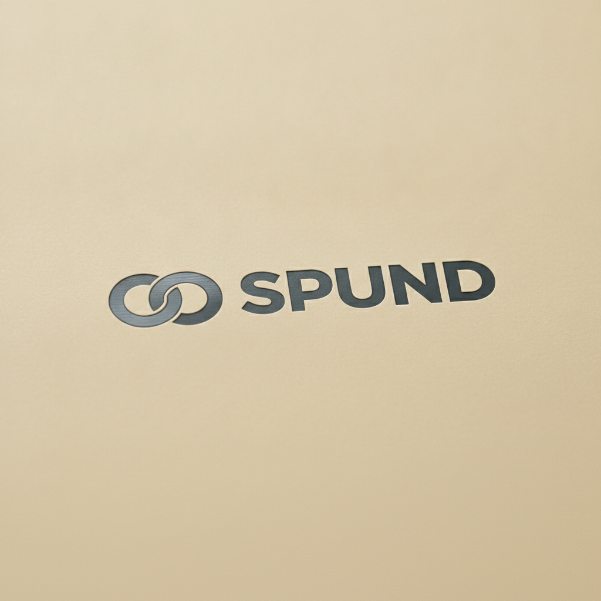

# Spund Brand Identity & Logo Specification

**TL;DR**  
The official brand identity for **Spund** has been finalized and codified as a high-performance B2B visual system [doc key="websiteAssets"]. Rejecting soft consumer-facing organic clichés, the identity centers on heavy-duty industrial minimalism and clinical hygiene [doc key="marketResearch"]. The master design system, color metrics, and physical application standards are detailed below to preserve Spund's premium market position across all digital and physical gastronomy loops [doc key="marketResearch"].

---

## 1. The Official Brand Logo Mark

The official Spund visual mark is engineered for high-density, fast-paced commercial coffee bars. It balances raw structural utility with professional B2B authority.

<div align="center">
  
</div>

---

## 2. Logo Construction and Design Rationale

The logo mark rejects decorative elements in favor of geometric, clinical, and mechanical honesty:

*   **The Interlocking closed-loop Icon**: Composed of two interlocking geometric circles intersected by a sharp, precise vertical channel. The circles symbolize our permanent, closed-loop 20L stainless-steel keg rotation. The vertical channel represents Nitrogen-pressurized, laminar liquid flow flowing directly from our high-flow taps.
*   **The "SPUND" Wordmark**: Rendered in a wide, custom geometric sans-serif typeface that mirrors the solid, unyielding build of heavy industrial brewery machinery. A razor-thin vertical slice cuts through the base of the letter **U**, symbolizing the physical insertion of a draft coupler and our complete break from traditional packaging waste.
*   **Airtight Seal Concept**: The German word "Spund" refers to a container bung, stopper, or unbreachable seal. The compactness of the icon reflects an airtight, pressurized closed system that protects our microfoam-optimized oat milk emulsion from environmental oxidation.

---

## 3. Technical Color System Standards

Our color palette is derived directly from the raw physical substrates of Berlin's premium specialty gastronomy loops:

| Color Token | Hex Code | System Purpose | Primary Application |
| :--- | :--- | :--- | :--- |
| **Spund Steel** | `#1A1C1E` | Primary Core | Solid backgrounds, technical B2B text, dark powder-coated finishes |
| **Oat Velvet** | `#FDFBF7` | Content Canvas | Warm cream backgrounds, warning tags, invoice sheets, and digital cards |
| **BSR Green** | `#10B981` | Ecological Focus | Key call-to-actions, ROI calculators, and sustainability badges |
| **Keg Brushed Grey** | `#E2E8F0` | Structural Accents | Dividing lines, border accents, and physical steel engraving zones |
| **Muted Slate** | `#64748B` | Secondary Typography | Explanatory captions, technical footnotes, and legal compliance text |

---

## 4. Typography Hierarchy Specifications

Our typographic pairing ensures immediate, high-speed legibility under fast-paced, dimly lit café environments:

*   **Headlines (Plus Jakarta Sans)**: Set in bold weights with tight tracking (`-0.03em`) to maintain an architectural, solid visual weight.
*   **Body & Technical Specs (Outfit)**: Set in regular weights with standard open tracking (`+0.01em`) to guarantee absolute legibility on physical keg collars, technical manual sheets, and screen interfaces.

```css
:root {
  --font-headline: "Plus Jakarta Sans", -apple-system, sans-serif;
  --font-body: "Outfit", -apple-system, sans-serif;
}
```

---

## 5. Critical Brand Protection & Substrate Rules

To protect Spund's premium B2B positioning, physical and digital implementations must strictly adhere to the following rules:

*   **The Zero Carton Rule**: Under no circumstances is the Spund logo to be printed on single-use paper cups, thermal receipts, or paper carton packaging. Spund is a 100% draft-only brand.
*   **Laser Etching Standard**: On all physical 20L slimline stainless steel kegs, the primary logo mark must be laser-etched directly onto the top steel collar with a minimum height of 15mm.
*   **Co-Branding on Taps**: Every installed countertop tap must feature our laser-etched brushed-steel plaque adjacent to the faucet: *"This venue is 100% Carton-Free. Oat milk poured fresh from the Spund draft loop."*
*   **Clear Space Requirement**: Always maintain a protective clear space boundary around the logo equal to 1.5 times the height of the letter **S** in the wordmark to preserve visual authority in crowded bar environments.

---

## 6. Implementation & GTM Timeline

To successfully operationalize this visual asset for our Summer 2026 pilot launch, the following steps are prioritized:

1. **Digital Integration**: Swap the existing navbar and footer logos on the deployed landing page (`index.html`) to reference the finalized high-end logo asset (`images/a-high-end-minimalist-industrial-logo-de.png`).
2. **Technical Document Branding**: Apply this logo specification and typographic rules directly to our upcoming HACCP hygiene guidelines and B2B Delivery Agreement sheets to ensure clinical authority across all operational paperwork.
3. **Hardware Fabrication**: Deliver the high-resolution vector layout of the interlocking loop and wide wordmark to our fabrication partner in Berlin-Lichtenberg to begin high-precision laser-etching on our first production run of fifty 20L slimline pilot kegs.
